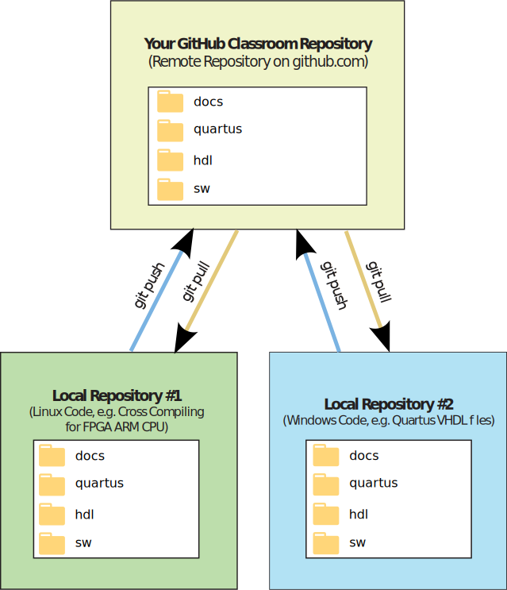
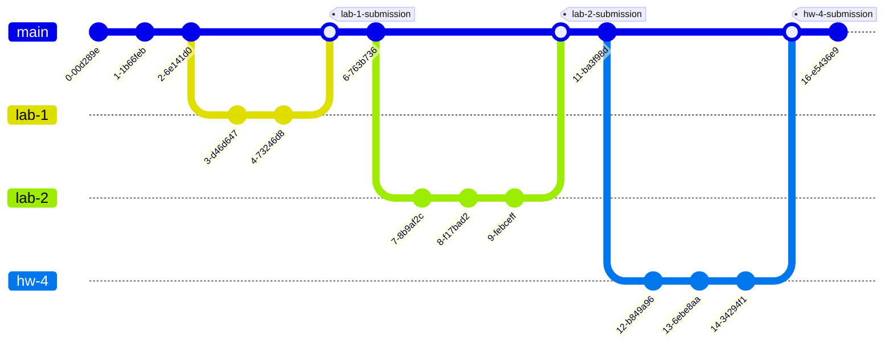

# EELE 467 GitHub Workflow

To facilitate working on your Windows machine and your Linux virtual machine, you'll clone the repository in each OS, as shown below.

<p align="center">

</p>

## Suggested Directory Structure

- 📁 **docs**: documentation and lab reports 
   - 📁 **assets**: images and other assets for documentation and reports
- 📁 **quartus**: Quartus project folder 
- 📁 **sim**: Questa simulation projects
- 📁 **hdl**: HDL source code
   - 📁 **led-patterns**: LED pattern lab HDL 
- 📁 **sw**: normal software source code
- 📁 **linux**: linux-related code, e.g., device drivers and device trees

The directory structure above separates source code primarly by type (e.g., HDL, C, Linux). For each top-level directory, you will create subdirectories for the projects or components, e.g. `led-patterns`, `synchronizer`, and so on. This is opposed to naming subdirectories as `lab1`, `hw4`, and so on; such a naming convention will make finding and reusing your components more difficult.


You may also choose to organize directories by "project" instead, thus you might have a top-level `led-patterns` directory. For example:

- 📁 **docs**: documentation and lab reports 
   - 📁 **assets**: images and other assets for documentation and reports
- 📁 **quartus**: Quartus project
- 📁 **led-patterns**: All HDL and C source code related to the led patterns project

> [!IMPORTANT]
> Organize your repository using folders to keep separate things separate. Do this in a way that makes the most sense to you. You'll use this repository for the entire semester; it's okay to refactor your repository organization throughout the semester.

## Cloning your GitHub Repository.  
You will need to create a local respository on your laptop.  You can do this by using the git clone command:
   ```
   git clone [url]
   ```
   
## Branch and Tag Naming Conventions
**Branch names:** lab-<#>, e.g. `lab-7` 
**Tag names:** lab-<#>-submission, e.g. `lab-7-submission` 
Using different branch and tag names help avoid ambiguities for both humans and git alike (git sometimes
complains when tag and branch names are the same because it doesn’t know which one you’re referring to.).

## Git Workflow for labs and homework
For each lab and homework, you’ll create a branch to work on the new lab. Using a new branch for development, often
called a *development branch*, *dev branch*, or *feature branch*, allows you to work on new features without 
introducing bugs into your production code. When you’re done with the lab, i.e. you’re done implementing the
new features, you’ll merge the *feature branch* back into the *main branch*. Once this merge is complete,
you’ll *tag* the corresponding commit on the *main branch* to indicate that the lab is done; this is conceptually
the same thing as tagging a commit to indicate a new version release (v0.7.4, for instance).




### Procedure

1. **Update your local repository** with any changes made to the remote repository:
   ```
     $ git pull
   ```
   **Note:** It is a good habit to get into of issuing a git pull so that any changes made to the remote repository will be reflected in the local repository. This also means that you should get into the habit of pushing changes to your remote repository.

2. **Create a new branch:**
   ```
    $ git branch lab-7
   ```
   
3. **Switch to the new branch:**
   ```
    $ git switch lab-7
     ```

4. **Do your development work** and make *atomic commits*[^1] along the way 🙂:
   ```
   git pull
   git add 
   git commit 
   git push 
   repeat
   ```
   **Note:** *when pushing your new branch*, you need to tell git to create that branch on the
remote repository:
   ```
   git push --set-upstream origin lab-7
   ```

5. When you’re done, **[create a pull request](https://docs.github.com/en/pull-requests/collaborating-with-pull-requests/proposing-changes-to-your-work-with-pull-requests/creating-a-pull-request)** from your branch into main.

6. Merge the pull request online. Make sure to select "make merge commit". We're using pull requests so it is easy for the instructor to view the changes related to your assignment; the instructor will not be approving your pull requests.

7. Pull the changes from the merge request into `main`:
   ```
   git switch main
   git pull
   ```

8. **Tag the submission** (which is the merge commit) with the tag name **lab-7-submission** (Git will open your default text editor and prompt you for additional information):
   ```
   $ git tag -a lab-7-submission
   ```
   **Note 1:** If it takes multiple submissions to get a successfully working lab demonstration, number the tag submissions, i.e. lab-7-submission2, lab-7-submission3, etc.
   **Note 2:** We're using an annotated tag (`-a`).


9. **Push the tag**:
   ```
   $ git push --tags
   ```

10. **Celebrate!** 🎉

[^1]: Working with atomic git commits means your commits are of the smallest possible size. 
Each commit does one, and only one simple thing, that can be summed up in a simple sentence. The amount of code change doesn't matter.
Writing atomic commits forces you to you make small, manageable changes as you tackle large tasks.

